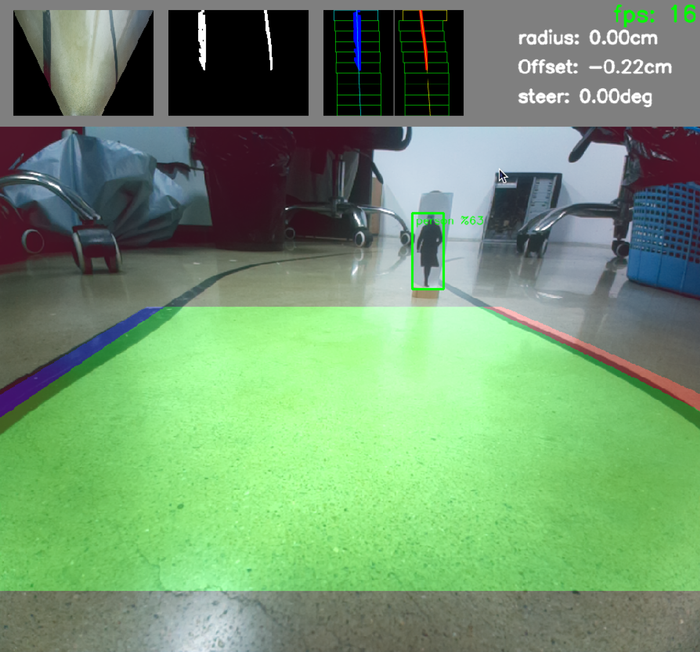

# Auto-driver Example

<p align="center">

</p>

---

This example mainly conducts lane detection and object recognition through a camera to simulate the automatic driving scenario of a car.

- lane detection: </br>
    - refers to the method of
    [ndrplz's Advanced Lane Finding Project](https://github.com/ndrplz/self-driving-car/edit/master/project_4_advanced_lane_finding/README.md)
    - simplifies the processes of camera distortion calibration and binary image generation, and adds the handling of the situation where only one lane line is detected
    - 
- object recognition: </br>
    - used the default object detection model in Picamera2

---
The steps of this project are the following:
- Apply a perspective transform to rectify image and obtain a bird's-eye view
- Use color transforms, gradients, etc., to create a thresholded binary image
- Use sliding windows to find lane pixels and and fit lane lines through curve fitting
- Determine the curvature of the lane and vehicle position with respect to center
- Warp the detected lane boundaries back onto the original image
- Perform object detection on the original image
- Control the car based on lane curvature, center offset, and object detection results.

---
run the example with mediapipe objecet detection

```bash
python3 main.py
```
</br>
run the example with hailo object detection

```bash
python3 main_hailo.py
```
