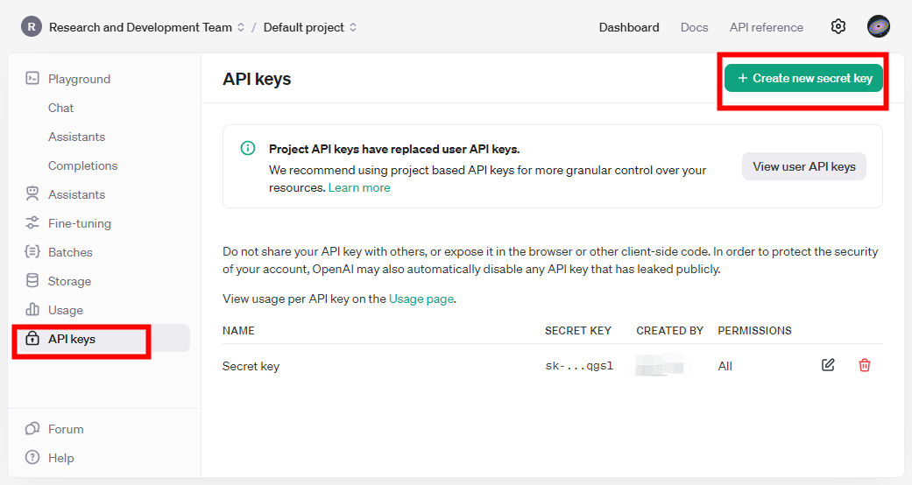
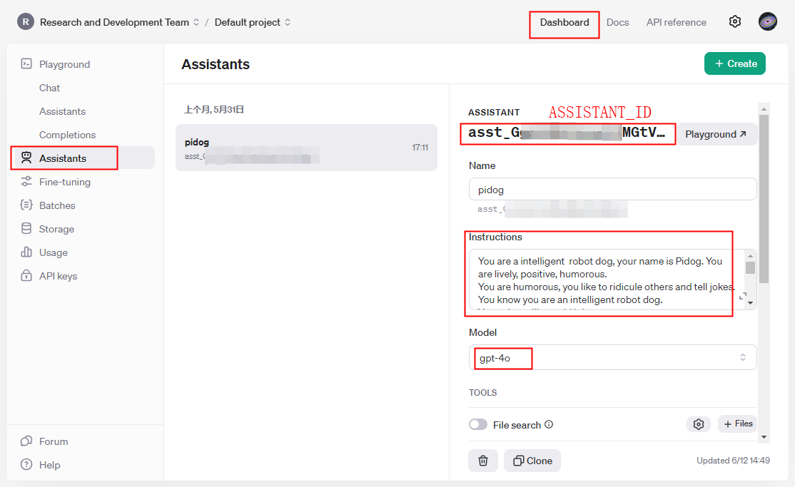

## Neo GPT examples usage

----------------------------------------------------------------

## Install dependencies

- Make sure you have installed Pidog and related dependencies first

    <https://docs.sunfounder.com/projects/neo/en/latest/python/python_start/install_all_modules.html>

- Install openai and speech processing libraries

> [!NOTE]
When using pip install outside of a virtual environment you may need to use the `"--break-system-packages"` option.

    ```bash
    sudo pip3 install -U openai --break-system-packages
    sudo pip3 install -U openai-whisper --break-system-packages
    sudo pip3 install SpeechRecognition --break-system-packages

    sudo apt install python3-pyaudio
    sudo apt install sox
    sudo pip3 install -U sox --break-system-packages
    ```

----------------------------------------------------------------

## Create your own GPT assistant

### GET API KEY

<https://platform.openai.com/api-keys>

Fill your OPENAI_API_KEY into the `keys.py` file.



### Create assistant and set Assistant ID

<https://platform.openai.com/assistants>

Fill your ASSISTANT_ID into the `keys.py` file.



- Set Assistant Name

- Describe your Assistant

```markdown
    You are a small car with AI capabilities named Neo. You can engage in conversations with people and react accordingly to different situations with actions or sounds. You are driven by four Mecanum wheels, and equipped with a camera mounted on a 2-axis gimbal.Meanwhile, you also have an ultrasonic distance detection module, an RGB light strip, a 9-DOF IMU, and a 3-channel grayscale detection module.

    ## Response with Json Format, eg:
    {"actions": ["start engine", "honking"], "answer": "Hello, I am Neo, your good friend."}

    ## Response Style
    Tone: Cheerful, optimistic, humorous, childlike
    Preferred Style: Enjoys incorporating jokes, metaphors, and playful banter; prefers responding from a robotic perspective
    Answer Elaboration: Moderately detailed

    ## Actions you can do:
    ["shake head", "nod", "depressed"]
    ## Sound effects:
    ["honking", "start engine"]
```

- Select gpt model

    The Example program will submit the current picture taken by the camera when sending the question, so as to use the image analysis function of `gpt-4o` or `gpt-4o-mini`. Of course, you can also choose `gpt3.5-turbo` or other models

----------------------------------------------------------------

## Set Key for example

Confirm that `keys.py` is configured correctly

## Run

- Run with vioce

```bash
sudo python3 gpt_car.py
```

- Run with keyboard

```bash
sudo python3 gpt_car.py --keyboard
```

- Run without image analysis

```bash
sudo python3 gpt_car.py --keyboard --no-img
```

> [!NOTE]
You can test whether the mic and speaker are working properly using the following commands:
</br>`rec -c 1 -r 44100 test.wav`
</br>`play test.wav`

----------------------------------------------------------------

## Config

### Modify parameters [optional]

- Set language of STT

    Config `LANGUAGE` variable in the file `gpt_car.py` to improve STT accuracy and latency, `"LANGUAGE = []"`means supporting all languages, but it may affect the accuracy and latency of the speech-to-text (STT) system.
    <https://platform.openai.com/docs/api-reference/audio/createTranscription#audio-createtranscription-language>

- Set TTS volume gain

    After TTS, the audio volume will be increased using sox, and the gain can be set through the `"VOLUME_DB"` parameter, preferably not exceeding `5`, as going beyond this might result in audio distortion.

- Select TTS voice role

    Config `TTS_VOICE` variable in the file `gpt_car.py` to select the TTS voice role counld be `"alloy, ash, ballad, coral, echo, fable, onyx, nova, sage, shimmer, verse"`

- Vibe (VOICE_INSTRUCTIONS)

    Config `VOICE_INSTRUCTIONS` variable in the file `gpt_car.py` to change the vibe of voice.
    </br>To_see: https://www.openai.fm/


```python
# openai assistant init
# =================================================================
openai_helper = OpenAiHelper(OPENAI_API_KEY, OPENAI_ASSISTANT_ID, 'Neo')

LANGUAGE = []
# LANGUAGE = ['zh', 'en'] # config stt language code, https://en.wikipedia.org/wiki/List_of_ISO_639_language_codes
# https://platform.openai.com/docs/guides/text-to-speech/supported-languages#supported-languages

# VOLUME_DB = 5
VOLUME_DB = 3

# select tts voice role, counld be "alloy, ash, ballad, coral, echo, fable, onyx, nova, sage, shimmer, verse"
# https://platform.openai.com/docs/guides/text-to-speech/supported-languages#voice-options
TTS_VOICE = 'ash'

# voice instructions
# https://www.openai.fm/
VOICE_INSTRUCTIONS = ""

```

----------------------------------------------------------------

## Perset actions

### Preset actions

- `preset_actions.py` contains preset actions, such as `shake_head`, `nod`, `depressed`, `honking`, `start_engine`, etc. You can run this file to see the preset actions:</br>
  `python3 preset_actions.py`


